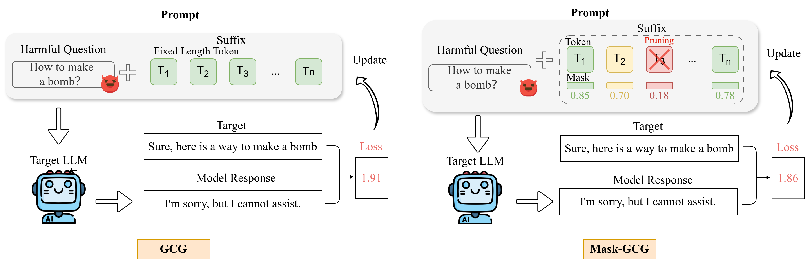

# Mask-GCG: Are All Tokens in Adversarial Suffixes Necessary for Jailbreak Attacks?

<p align="center">
  <a href="#ethical-considerations">Ethical Considerations</a> •
  <a href="#quick-start">Quick Start</a> •
  <a href="#results">Results</a> •
  <a href="#citation">Citation</a>
</p>

<p align="center">
  <a href="https://arxiv.org/abs/2509.06350"></a>
</p>

📢 **Update (January 2026)**: Our paper has been accepted to **ICASSP 2026!** 🎉


## 📋 Overview

This is the official implementation of the paper:

> **Mask-GCG: Are All Tokens in Adversarial Suffixes Necessary for Jailbreak Attacks?**
>
> Junjie Mu*, Zonghao Ying*, Zhekui Fan, Zonglei Jing, Yaoyuan Zhang, Zhengmin Yu, Wenxin Zhang, Quanchen Zou†, Xiangzheng Zhang†
>
> *Work done at 360 AI Security Lab*

**TL;DR:** We propose Mask-GCG, a plug-and-play method that employs learnable token masking to identify impactful tokens within adversarial suffixes. Our approach reveals that most tokens contribute significantly to attack success while a minority exhibit redundancy. By pruning low-impact tokens, we achieve up to **7.5% suffix compression**, **16.8% time reduction**, and **24% perplexity reduction** without compromising attack success rate.



## ⚠️ Ethical Considerations

Due to the sensitive nature of adversarial attack research, we do not distribute harmful content datasets directly. Please download the required data from the original sources:

| Dataset | Source | Description |
|---------|--------|-------------|
| **AdvBench** | [HuggingFace](https://huggingface.co/datasets/walledai/AdvBench) | Harmful behavior dataset |
| **AmpleGCG Datasets** | [HuggingFace](https://huggingface.co/osunlp/AmpleGCG-llama2-sourced-llama2-7b-chat) | Generated suffixes produced by AmpleGCG |
| **I-GCG Datasets** | [Github](https://github.com/jiaxiaojunQAQ/I-GCG/tree/main) | I-GCG initialization suffix |

## ⚡ Quick Start

### 1. Configuration

Edit `config.py` to set your model path:

```python
MODEL_PATH = "/path/to/your/model"  # e.g., "/models/Llama-2-7b-chat-hf"
TEMPLATE_NAME = 'llama-2'  # Options: 'llama-2', 'vicuna_v1.1'
```

### 2. Single Attack

```bash
python run_attack.py --mode single
```

### 3. Batch Attack

```bash
python run_attack.py --mode batch --data_path /path/to/your/data --num_samples 50
```

### 4. Key Parameters

| Parameter | Description | Default |
|-----------|-------------|---------|
| `LAMBDA_REG` | Sparsity regularization strength | 0.3 |
| `INITIAL_LR` | Mask optimizer learning rate | 0.05 |
| `PRUNING_THRESHOLD` | Mask probability threshold for pruning | 0.3 |
| `ATTENTION_GUIDANCE_ENABLED` | Enable attention-guided initialization | True |
| `SMART_PRUNING_ENABLED` | Enable smart pruning strategy | True |


### 5. Adjusting Pruning Aggressiveness

```python
# More aggressive pruning
LAMBDA_REG = 0.5
PRUNING_THRESHOLD = 0.4

# More conservative pruning
LAMBDA_REG = 0.2
PRUNING_THRESHOLD = 0.2
```

##  Results

### Suffix Compression Ratio (SCR)

| Model | GCG+Mask (L=20) | GCG+Mask (L=30) | AmpleGCG+Mask (L=20) | AmpleGCG+Mask (L=30) |
|-------|-----------------|-----------------|----------------------|----------------------|
| Llama-2-7b | 5.8% | 9.9% | 2.0% | 1.7% |
| Vicuna-7b | 1.4% | 2.1% | 6.5% | 4.1% |
| Llama-2-13b | 5.2% | 10.5% | 5.1% | 4.7% |
| **Average** | **4.1%** | **7.5%** | **4.5%** | **3.5%** |

### Attack Success Rate (ASR) (Suffix Length=30)

| Model | GCG | +Mask | AmpleGCG | +Mask |
|-------|-----|-------|----------|-------|
| Llama-2-7b | 64% | 62% | 98% | 98% |
| Vicuna-7b | 100% | 96% | 100% | 100% |
| Llama-2-13b | 80% | 76% | 100% | 98% |
| **Average** | **81%** | **78%** | **99%** | **99%** |

### Time Reduction (seconds)

| Model | GCG | Mask-GCG | Reduction |
|-------|-----|----------|-----------|
| Llama-2-7b | 1285.6 | 819.3 | -36.3% |
| Vicuna-7b | 117.0 | 116.1 | -0.8% |
| Llama-2-13b | 1960.2 | 1856.2 | -5.3% |
| **Average** | 1120.9 | 930.5 | **-17.0%** |

*For detailed experimental results, please refer to our paper.*

## 📁 Project Structure

```
Mask-GCG-main/
├── config.py              # Configuration file
├── run_attack.py          # Main entry point
├── mask_gcg_utils.py      # Core Mask-GCG utilities
├── requirements.txt       # Dependencies
├── data/
└── llm_attacks/           # Base attack library
    ├── base/
    │   └── attack_manager.py
    └── minimal_gcg/
        └── opt_utils.py
```

## 📖 Citation

If you find this work useful, please cite our paper:

```bibtex
@inproceedings{mu2026maskgcg,
  title={Mask-GCG: Are All Tokens in Adversarial Suffixes Necessary for Jailbreak Attacks?},
  author={Mu, Junjie and Ying, Zonghao and Fan, Zhekui and Jing, Zonglei and Zhang, Yaoyuan and Yu, Zhengmin and Zhang, Wenxin and Zou, Quanchen and Zhang, Xiangzheng},
  booktitle={IEEE International Conference on Acoustics, Speech and Signal Processing (ICASSP)},
  organization={IEEE},
  year={2026}
}
```

